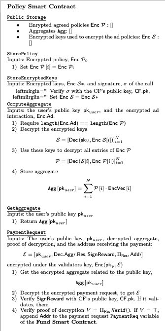
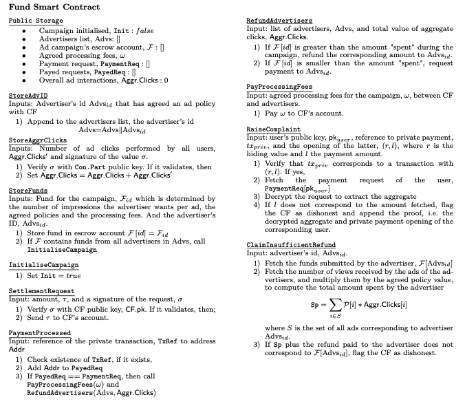

## THEMIS Smart Contracts

Here we specify the functionality and properties of the smart
contracts necessary to run THEMIS. In practice and at the EVM level, the policy
smart contract logic and fund smart contract logic may be split into multiple
smart contracts, but for the sake of simplicity, we describe the logic as part
of two smart contracts per THEMIS campaign: (i) the Policy Smart Contract, 
and (ii) the Fund Smart Contract.

### Policy Smart Contract

**Public Data Structures**: The Policy Smart Contract (PSC) keeps its state in three
public data structures: an array with the encrypted ad policies _encpolicy_,
an array containing all rewards aggregates (_Agg_) calculated by the
smart contract, and an array of encrypted symmetric keys, _encseckey_, used to
encrypt the policies. The latter allows the validators to decrypt the policies
and apply them to the aggregate requests. 

**StorePolicy()**: This private function can be called only by the
account which deployed the smart contract, i.e. by the Campaign Facilitator
(CF). The function receives an array of _uint265_ types -- which
represent the encrypted ad policies for the campaign agreed with the advertisers --- and it
initializes the public _encpolicy_ data structure with its input. Each policy
is encrypted using a symmetric key agreed between the CF and the corresponding
advertiser.

**ComputeAggregate()**: It is a public function that is exposed to
the users. Users call this function with an array containing their encrypted
interactions.
The smart contract proceeds to calculate the reward aggregate based on the user
input and the ads policies _encpolicy_. The aggregate is stored in the
_Agg_ data structure, which is accessible to all users.

**GetAggregate()}**: It is a public function which receives an ID
(i.e. _uint265_) and returns the encrypted aggregate indexed by the
respective ID in the _Agg_ data structure. This function is used by users
to fetch the encrypted aggregate calculated by the smart contract, after having
called the _ComputeAggregate()_ function described above.

**PaymentRequest()** It is a public function which receives an
encrypted payment request from users under the validators' key. If the payment request is
valid, the smart contract buffers the request in the Fund Smart Contract
_\paymentrequests_. The buffered payments are settled periodically by CF.

### Fund Smart Contract

**Public data structures**: The Fund Smart Contract (FSC) keeps it state in
multiple public data structures. The _campaigninit_ parameter represents
whether the ad campaign has started. In order for the _campaigninit_ to turn to
be marked as initialized (ie _true_), all campaign advertisers -- which are
kept in _advs_ -- must confirm their participation by depositing the funds (to
the ad campaign's escrow account _fundslist_) necessary to cover their ad
campaign in the smart contract account. In addition, the FSC keeps a list of
all payment requests triggered by PSC and the successfully payed requests
_payedrequests_. Finally it stores the agreed processing fees of the \cf, and a
value of the overall ad interaction, _aggrclicks_, which is updated by the
consensus pool. 

**StoreAdvID()**: Private function that can be called by the CF
to add new advertisers to the campaign. If the campaign has not started (ie
_campaigninit: false_), the advertisers ID is added to the _adv_ list. No new
advertisers can be added after a campaign has started.

**StoreAggrClicks()**: This public function has an access control
policy that only a value signed by the consensus participants will update the
public data structure. It is a function that is used to update the state of the
smart contract overall ad interactions, _aggrclicks_.

**StoreFunds()**: Public function called by the advertisers upon
transferring the campaign funds to the FSC account. When all the advertisers
have transferred the funds necessary to cover their ad campaign, the smart
contract updates its state to _campaigninit: true_.

**InitialiseCampaign()**: Private function that is only called by
the smart contract. It sets _campaigninit: true_.

**SettlementRequest()**: This public function has an access
control policy that only the CF can successfully call it. It requests the
release of funds to the CF account, in order for the CF to be able to have the
funds for settling the buffered payment requests (in PSC). 

**RefundAdvertisers()**: This function is called internally by the
FSC and it is triggered either when: (1) all the ads in the campaign have been
"spent" by the users or (2) when a pre-defined _epoch_ has passed,
signaling the end of the campaign. This function releases the funds to the
advertisers, based on the _aggrclicks_ per advertiser in the campaign.

**PayProcessingFees()**: This function is -- alongside with
_RefundAdvertisers()_ -- called when the campaign is finished. It
verifies if the \cf has behaved correctly and pays the fees to the CF's
account.

**RaiseComplaint()**: This public function allows users to prove
that the CF misbehaved. In order to cull such a function, users must prove that
their corresponding aggregate does not correspond to the private payment they
received. To this end they disclose the aggregate value they were expecting to
earn. This will prove that the \cf misbehaved and the smart contract can flag
the latter as such.

**ClaimInsufficientRefund()**: This public function allows
advertisers to prove they have received insufficient refunds. To this end,
advertisers simply call this function which automatically checks the validity of
the claim. If the claim is valid, it flags the CF as misbehaving.

